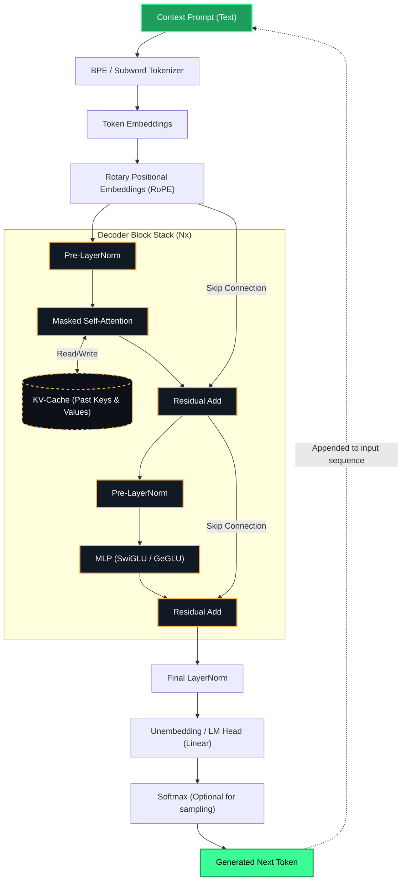

# Modern LLM Architecture (Decoder-Only GPT)

This document visualizes the **Decoder-only** Transformer architecture. 

Modern Large Language Models (LLMs) such as GPT-3, LLaMA, and Claude discard the Encoder entirely. Instead, they rely on a massive stack of Decoder blocks optimized strictly for auto-regressive next-token prediction.

## Architecture & KV-Caching Flowchart

### Core LLM Evolutions
1. **Decoder-Only Design:** The prompt and the generated text are processed uniformly through a single stack of masked self-attention blocks.
2. **KV-Caching (Inference Optimization):** During text generation, recalculating the attention matrices for past tokens is highly redundant. The $K$ and $V$ vectors for past tokens are stored in the **KV-Cache** in High Bandwidth Memory (HBM). For every new token, the model only computes the $Q$ vector and performs a dot product against the cached $K$, turning a compute-bound $O(N^2)$ operation into a memory-bound $O(N)$ operation.
3. **Pre-LayerNorm:** Moving the Layer Normalization to the *start* of the residual block (before Attention and MLP) significantly improves training stability at massive scales compared to the original Post-LayerNorm design.
4. **RoPE (Rotary Positional Embeddings):** Instead of adding static embeddings at the bottom, modern LLMs apply a rotation matrix to the $Q$ and $K$ vectors natively within the attention module, leading to superior context length extrapolation.
